<a href="https://mchalise.com.np">
  <picture>
    <source media="(prefers-color-scheme: dark)" srcset="./assets/night.svg">
    
  </picture>
</a>

<h3 align="center">Manish Chalise · Engineer, Kathmandu</h3>

  <a href="https://mchalise.com.np"><b>Walk the block →</b></a> ·
  <a href="https://mchalise.com.np/resume/ManishChaliseResume.pdf">Résumé (PDF)</a> ·
  <a href="https://gurkhalabs.com">Gurkha Labs</a> ·
  <a href="https://habrecare.app">Habre Care</a>

Twelve-plus years building web and web3 systems: correspondent banking, fintech, digital money and blockchain. Five-plus of them deep in on-chain data analysis and ingestion across the top exchanges and chains. Now CTO at **Gurkha Labs**, a senior studio building for international clients, with AI agents as the amplifier.

### The block, building by building

| | Where | What |
|---|---|---|
| **Now** | [Gurkha Labs](https://gurkhalabs.com) · Kathmandu | Chief Technology Officer |
| 2024–26 | Independent consultant | Web3, LLM prototypes, product guidance for early founders |
| 2017–23 | [ZenLedger](https://zenledger.io) · Seattle, remote (via WhiteHat Engineering) | Founding Engineer & Lead. Joined at MVP, scaled through a $15M Series B. Led a team of up to 15; rewrote the tax engine from Rails to Go (70% less compute, 60% faster) |
| Federal | BATS · ZenLedger's government line | Engineering Lead, crypto forensics used by IRS investigation units |
| 2015–17 | [InvestReady](https://www.investready.com) · Eepos IT | Built the investor-eligibility verification platform (Laravel) |
| 2014–15 | First Global Data · Toronto, remote | REST/SOAP services for cross-border digital money |
| 2013–14 | EB Pearls · Kathmandu | Web apps and security audits for government agencies |
| 2009–13 | Kathmandu University | B.E. Computer Engineering |

**Stack I reach for:** Go · Ruby on Rails · AWS · Laravel · LLMs · on-chain data pipelines

The banner switches to night when GitHub is in dark mode. Built from the same art as the site by <a href="./scripts/build_banner.py">scripts/build_banner.py</a>.
