  <a href="https://mchalise.com.np"><b>Walk the block →</b></a> ·
  <a href="https://mchalise.com.np/resume/ManishChaliseResume.pdf">Résumé (PDF)</a> ·
  <a href="https://gurkhalabs.com">Gurkha Labs</a> ·
  <a href="https://habrecare.app">Habre Care</a>

Twelve-plus years building web and web3 systems: correspondent banking, fintech, digital money and blockchain. Five-plus of them deep in on-chain data analysis and ingestion across the top exchanges and chains. Now CTO at **Gurkha Labs**, a senior studio building for international clients, with AI agents as the amplifier.

### The block, building by building

<a href="https://mchalise.com.np/#gurkha"><picture><source media="(prefers-color-scheme: dark)" srcset="./assets/rows/gurkha-dark.svg"></picture></a> 
<a href="https://mchalise.com.np/#freelance"><picture><source media="(prefers-color-scheme: dark)" srcset="./assets/rows/freelance-dark.svg"></picture></a> 
<a href="https://mchalise.com.np/#zenledger"><picture><source media="(prefers-color-scheme: dark)" srcset="./assets/rows/zenledger-dark.svg"></picture></a> 
<a href="https://mchalise.com.np/#bats"><picture><source media="(prefers-color-scheme: dark)" srcset="./assets/rows/bats-dark.svg"></picture></a> 
<a href="https://mchalise.com.np/#investready"><picture><source media="(prefers-color-scheme: dark)" srcset="./assets/rows/investready-dark.svg"></picture></a> 
<a href="https://mchalise.com.np/#fgd"><picture><source media="(prefers-color-scheme: dark)" srcset="./assets/rows/fgd-dark.svg"></picture></a> 
<a href="https://mchalise.com.np/#eb"><picture><source media="(prefers-color-scheme: dark)" srcset="./assets/rows/eb-dark.svg"></picture></a> 
<a href="https://mchalise.com.np/#ku"><picture><source media="(prefers-color-scheme: dark)" srcset="./assets/rows/ku-dark.svg"></picture></a>

Each row opens its chapter on the site ↗ · <a href="https://gurkhalabs.com">gurkhalabs.com</a> · <a href="https://zenledger.io">zenledger.io</a> · <a href="https://bats.ai/">bats.ai</a> · <a href="https://www.investready.com">investready.com</a> · <a href="https://ebpearls.com.au/">ebpearls.com.au</a> · <a href="https://ku.edu.np/">ku.edu.np</a>

### Tools of the trade

<picture><source media="(prefers-color-scheme: dark)" srcset="./assets/stack-dark.svg"></picture>

The banner follows the real clock in Kathmandu (day, dusk, night) and lights a window ring for every few days I ship. Rebuilt hourly by a GitHub Action from the same art as the site.
