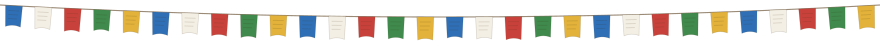
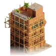
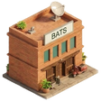
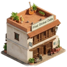

  <a href="https://mchalise.com.np"><b>Walk the block →</b></a> ·
  <a href="https://mchalise.com.np/resume/ManishChaliseResume.pdf">Résumé (PDF)</a> ·
  <a href="https://gurkhalabs.com">Gurkha Labs</a> ·
  <a href="https://habrecare.app">Habre Care</a>

Twelve-plus years building web and web3 systems: correspondent banking, fintech, digital money and blockchain. Five-plus of them deep in on-chain data analysis and ingestion across the top exchanges and chains. Now CTO at **Gurkha Labs**, a senior studio building for international clients, with AI agents as the amplifier.

### The block, building by building

<table>
<tr>
<td align="center" width="76"></td>
<td><a href="https://gurkhalabs.com"><b>Gurkha Labs</b></a> · Kathmandu <i>Chief Technology Officer</i> A senior studio building for international clients, with AI agents as the amplifier.</td>
<td align="right" width="96"><code>Now</code></td>
</tr>
<tr>
<td align="center" width="76"></td>
<td><b>Independent consultant</b> · Kathmandu <i>Freelance</i> Web3 concepts, LLM prototypes and product guidance for early founders.</td>
<td align="right" width="96"><code>2024–26</code></td>
</tr>
<tr>
<td align="center" width="76"></td>
<td><a href="https://zenledger.io"><b>ZenLedger</b></a> · Seattle, remote via WhiteHat Engineering <i>Founding Engineer &amp; Lead Software Engineer</i> Joined at MVP, scaled through a $15M Series B. Led a team of up to 15; rewrote the tax engine from Rails to Go (70% less compute, 60% faster). 100K+ customers · $50B+ assets tracked · 10B+ transaction rows · 100+ exchanges &amp; chains</td>
<td align="right" width="96"><code>2017–23</code></td>
</tr>
<tr>
<td align="center" width="76"></td>
<td><a href="https://bats.ai/"><b>BATS</b></a> · ZenLedger’s government line <i>Engineering Lead · crypto forensics</i> Used by IRS Criminal and Civil Investigation units.</td>
<td align="right" width="96"><code>Federal</code></td>
</tr>
<tr>
<td align="center" width="76"></td>
<td><a href="https://www.investready.com"><b>InvestReady</b></a> · Eepos IT <i>Freelance developer</i> Built the investor-eligibility verification platform (Laravel).</td>
<td align="right" width="96"><code>2015–17</code></td>
</tr>
<tr>
<td align="center" width="76"></td>
<td><b>First Global Data</b> · Toronto, remote <i>Software Engineer</i> REST and SOAP services for cross-border digital money.</td>
<td align="right" width="96"><code>2014–15</code></td>
</tr>
<tr>
<td align="center" width="76"></td>
<td><a href="https://ebpearls.com.au/"><b>EB Pearls</b></a> · Kathmandu <i>Web Application Developer</i> Web apps and security audits for government agencies.</td>
<td align="right" width="96"><code>2013–14</code></td>
</tr>
<tr>
<td align="center" width="76"></td>
<td><a href="https://ku.edu.np/"><b>Kathmandu University</b></a> · Dhulikhel <i>B.E. Computer Engineering</i> The first brick on the block.</td>
<td align="right" width="96"><code>2009–13</code></td>
</tr>
</table>

Tap a building to open its chapter on the site ↗

**Stack I reach for:** Go · Ruby on Rails · AWS · Laravel · LLMs · on-chain data pipelines

The banner follows the real clock in Kathmandu (day, dusk, night) and lights a window ring for every few days I ship. Rebuilt hourly by a GitHub Action from the same art as the site.
